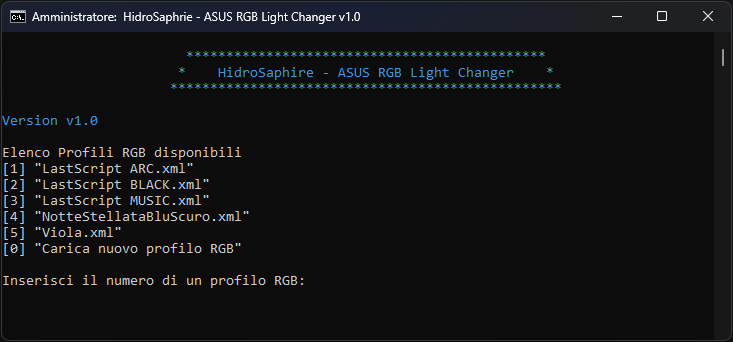

  <h1>ASUS RGB Light Changer</h1>

## What is it?
Tired of having to open the slow "Armoury Crate" application every time to change the "Aura Effects" of your aRGB LEDs?
Save your led configurations and change them at runtime with the very fast **ASUS RGB Light Changer** script!
ASUS RGB Light Changer is a useful script (written in [Batch]) for [Microsoft Windows] that allows you to locally save the profiles 
of the aRGB LED mergers that you have configured on Armory Crate and, later, to set them quickly without necessarily having to open 
the Armory Crate application again every time you want to change configuration!

## Author & Developers
 - [Enrico Mancuso] :computer:

## Screenshot :camera:

	
	 

[Enrico Mancuso]: https://github.com/HidroSaphire
[Batch]: https://en.wikipedia.org/wiki/Batch_file
[Microsoft Windows]: https://en.wikipedia.org/wiki/Windows_11
